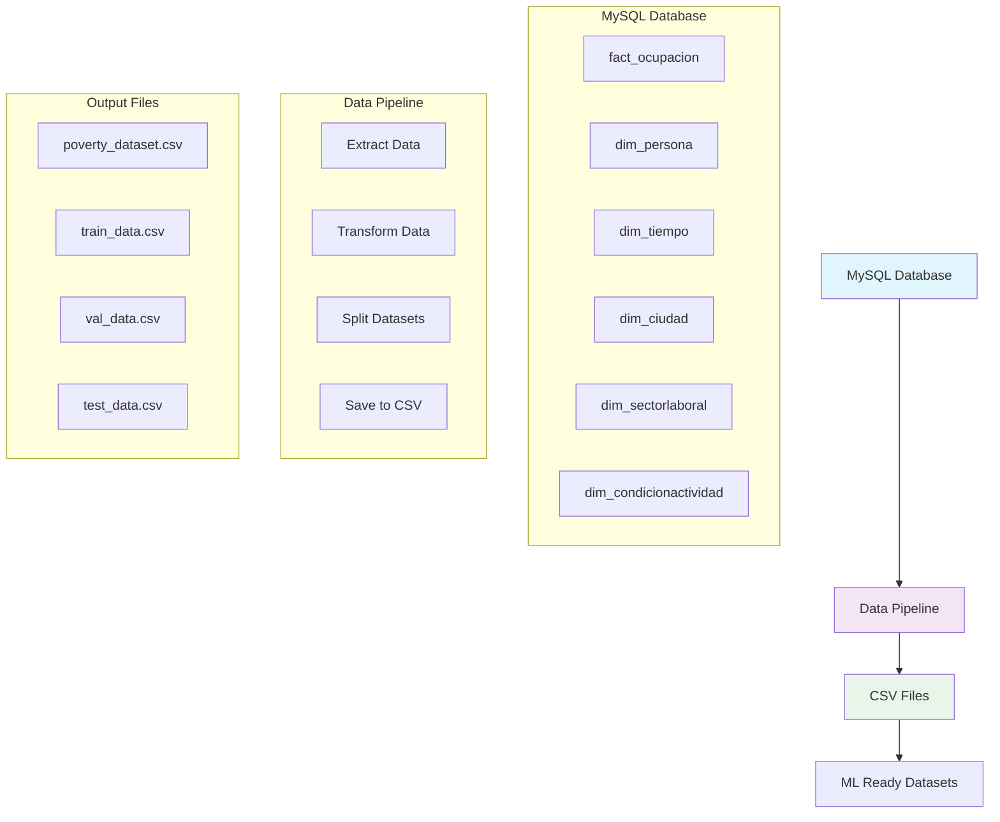
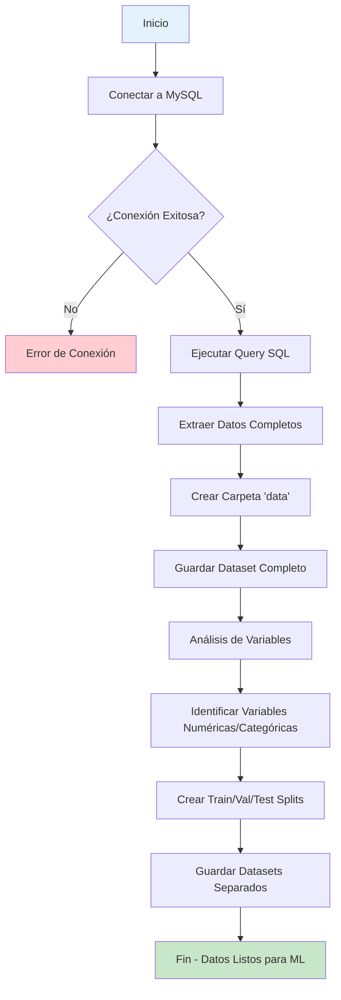
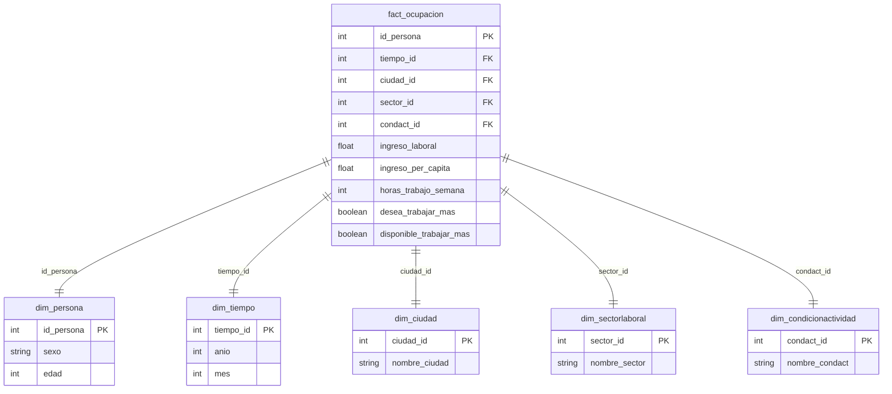

# 📊 Sistema de Análisis de Pobreza - BI Project

## 🎯 Descripción del Proyecto

Este proyecto implementa un sistema completo de Business Intelligence (BI) para el análisis de pobreza, incluyendo:

- **Base de Datos MySQL**: Almacenamiento estructurado de datos demográficos y laborales
- **Pipeline de Datos**: Extracción, transformación y preparación de datos para ML
- **Análisis Predictivo**: Preparación de datasets para modelos de machine learning

## 🏗️ Arquitectura del Sistema



## 🚀 Instalación y Configuración

### Prerrequisitos

- Python 3.8+
- MySQL Server
- Docker (opcional, para base de datos)

### 1. Clonar el Repositorio

```bash
git clone <repository-url>
cd bi/project
```

### 2. Configurar Entorno Virtual

```bash
# Crear entorno virtual
python -m venv venv

# Activar entorno virtual
# En Linux/Mac:
source venv/bin/activate
# En Windows:
venv\Scripts\activate
```

### 3. Instalar Dependencias

```bash
pip install -r requirements.txt
```

### 4. Configurar Base de Datos MySQL

Este paso va a tomar el archivo `bi.sql` y lo va a ejecutar en la base de datos `poverty_analysis` automáticamente usando docker compose.

```bash
# Levantar MySQL con Docker Compose
docker compose up -d

# Verificar que el contenedor esté corriendo
docker ps
```

## 📈 Pipeline de Datos

### Flujo de Procesamiento



### Estructura de Datos



## 🔧 Uso del Pipeline

### Ejecutar Pipeline Completo

```bash
# Activar entorno virtual (si no está activado)
source venv/bin/activate

# Ejecutar pipeline de datos
python data_pipeline.py
```

### Salida Esperada

```
=== PIPELINE DE DATOS PARA ANÁLISIS DE POBREZA ===
Carpeta de datos: data
Extrayendo datos de MySQL...
Dataset extraído: (10000, 14)
Dataset guardado como data/poverty_dataset.csv

=== ANÁLISIS DE VARIABLES PARA PREDICCIÓN DE POBREZA ===
Columnas disponibles: ['id_persona', 'tiempo_id', 'anio', 'mes', 'nombre_ciudad', 'nombre_sector', 'nombre_condact', 'sexo', 'edad', 'ingreso_laboral', 'ingreso_per_capita', 'horas_trabajo_semana', 'desea_trabajar_mas', 'disponible_trabajar_mas']

Variables numéricas (8): ['id_persona', 'tiempo_id', 'anio', 'mes', 'edad', 'ingreso_laboral', 'ingreso_per_capita', 'horas_trabajo_semana']
Variables categóricas (6): ['nombre_ciudad', 'nombre_sector', 'nombre_condact', 'sexo', 'desea_trabajar_mas', 'disponible_trabajar_mas']

=== CREANDO CONJUNTOS DE DATOS ===
Train: 6400 muestras
Validation: 1600 muestras
Test: 2000 muestras

=== ARCHIVOS CREADOS ===
- data/poverty_dataset.csv (dataset completo)
- data/train_data.csv (entrenamiento)
- data/val_data.csv (validación)
- data/test_data.csv (test)

✅ Pipeline completado. Datos listos para Keras!
```

## 📁 Estructura de Archivos Generados

```
project/
├── data/                          # Carpeta con datasets procesados
│   ├── poverty_dataset.csv        # Dataset completo
│   ├── train_data.csv            # Datos de entrenamiento (64%)
│   ├── val_data.csv              # Datos de validación (16%)
│   └── test_data.csv             # Datos de test (20%)
├── data_pipeline.py              # Script principal del pipeline
├── bi.sql                        # Script de base de datos
├── docker-compose.yml            # Configuración Docker
├── requirements.txt              # Dependencias Python
└── README.md                     # Este archivo
```

## 🔍 Funcionalidades del Pipeline

### 1. Extracción de Datos
- **Fuente**: Base de datos MySQL con esquema dimensional
- **Query**: JOIN entre tablas fact y dimensiones
- **Campos**: 14 variables demográficas y laborales

### 2. Análisis Exploratorio
- **Identificación automática** de variables numéricas y categóricas
- **Estadísticas descriptivas** del dataset
- **Detección de indicadores de pobreza** basada en nombres de columnas

### 3. Preparación para ML
- **División automática** en train/validation/test (64%/16%/20%)
- **Manejo de variables objetivo** (target column)
- **Guardado estructurado** en formato CSV

### 4. Variables del Dataset

| Variable                  | Tipo       | Descripción                      |
| ------------------------- | ---------- | -------------------------------- |
| `id_persona`              | Numérico   | Identificador único de persona   |
| `anio`, `mes`             | Numérico   | Dimensiones temporales           |
| `nombre_ciudad`           | Categórico | Ciudad de residencia             |
| `nombre_sector`           | Categórico | Sector laboral                   |
| `nombre_condact`          | Categórico | Condición de actividad           |
| `sexo`                    | Categórico | Género                           |
| `edad`                    | Numérico   | Edad en años                     |
| `ingreso_laboral`         | Numérico   | Ingreso por trabajo              |
| `ingreso_per_capita`      | Numérico   | Ingreso per cápita               |
| `horas_trabajo_semana`    | Numérico   | Horas trabajadas por semana      |
| `desea_trabajar_mas`      | Booleano   | Deseo de trabajar más horas      |
| `disponible_trabajar_mas` | Booleano   | Disponibilidad para trabajar más |

## 🛠️ Comandos Útiles

### Verificar Estado de la Base de Datos
```bash
# Conectar a MySQL
mysql -u analyst -p poverty_analysis

# Verificar tablas
SHOW TABLES;

# Verificar datos
SELECT COUNT(*) FROM fact_ocupacion;
```

### Verificar Archivos Generados
```bash
# Listar archivos en carpeta data
ls -la data/

# Ver tamaño de archivos
du -h data/*.csv

# Ver primeras líneas de un archivo
head -5 data/poverty_dataset.csv
```

### Limpiar Datos Generados
```bash
# Eliminar carpeta data (cuidado: elimina todos los datasets)
rm -rf data/
```

## 🔧 Configuración Avanzada

### Modificar Parámetros del Pipeline

En `data_pipeline.py`, puedes ajustar:

```python
# Tamaños de división de datos
test_size=0.2    # 20% para test
val_size=0.2     # 20% para validación (del 80% restante)

# Variable objetivo personalizada
target_column = 'ingreso_per_capita'  # Cambiar variable objetivo
```

### Variables de Entorno (Opcional)

Crear archivo `.env`:
```env
MYSQL_HOST=localhost
MYSQL_PORT=3306
MYSQL_DATABASE=poverty_analysis
MYSQL_USER=analyst
MYSQL_PASSWORD=analyst123
```

## 🐛 Solución de Problemas

### Error de Conexión a MySQL
```bash
# Verificar que MySQL esté corriendo
sudo systemctl status mysql

# Verificar credenciales
mysql -u analyst -p
```

### Error de Dependencias
```bash
# Reinstalar dependencias
pip install --upgrade -r requirements.txt
```

### Error de Permisos
```bash
# Dar permisos de escritura a la carpeta data
chmod 755 data/
```

## 📊 Próximos Pasos

1. **Análisis Exploratorio**: Crear visualizaciones con los datos generados
2. **Modelos de ML**: Implementar modelos predictivos con Keras/TensorFlow
3. **Dashboard**: Crear interfaz web para visualización
4. **Automatización**: Programar ejecución automática del pipeline

# Sistema de Análisis de Pobreza - ML Pipeline y Aplicación Web

## 📋 Descripción General

Este proyecto implementa un sistema completo de análisis predictivo de pobreza utilizando machine learning, con capacidades avanzadas de análisis de datos y una interfaz web moderna para la visualización de resultados.

## 🚀 Características Principales

### 🔬 Análisis de Datos Avanzado
- **Análisis Exploratorio Completo**: Evaluación automática de calidad de datos, identificación de patrones y estadísticas descriptivas
- **Detección de Indicadores de Pobreza**: Identificación automática de variables relacionadas con pobreza
- **Análisis de Correlaciones**: Cálculo de importancia de características basado en correlaciones con indicadores de pobreza
- **Evaluación de Calidad de Datos**: Métricas de completitud, consistencia y precisión

### 🤖 Modelos de Machine Learning
- **Redes Neuronales**: Modelos de deep learning para predicción de alta precisión
- **Modelos Lineales**: Regresión logística y lineal para análisis estadístico robusto
- **Selección Automática de Modelos**: Evaluación automática y selección del mejor modelo
- **Validación Cruzada**: Evaluación robusta del rendimiento de los modelos

### 📊 Aplicación Web Interactiva
- **Interfaz Moderna**: Diseño responsive con Bootstrap 5 y Font Awesome
- **Análisis en Tiempo Real**: Procesamiento y visualización inmediata de resultados
- **Múltiples Formatos de Entrada**: Soporte para Excel (.xlsx, .xls) y CSV
- **Exportación de Resultados**: Exportación a Excel, CSV y reportes completos

### 📈 Visualización y Reportes
- **Dashboard Interactivo**: Métricas de calidad de datos, insights y recomendaciones
- **Análisis de Confianza**: Niveles de confianza y evaluación de riesgo
- **Recomendaciones Automáticas**: Sugerencias basadas en los resultados del análisis
- **Reportes Detallados**: Información completa sobre predicciones y calidad del modelo

## 🏗️ Arquitectura del Sistema

```
project/
├── ml_pipeline/           # Pipeline de machine learning
│   ├── main.py           # Punto de entrada principal
│   ├── data_analyzer.py  # Análisis exploratorio de datos
│   ├── feature_engineer.py # Ingeniería de características
│   ├── model_trainer.py  # Entrenamiento de modelos
│   ├── linear_models.py  # Modelos lineales
│   ├── neural_network.py # Redes neuronales
│   └── requirements.txt  # Dependencias del pipeline
├── prediction_app/        # Aplicación web Flask
│   ├── app.py           # Servidor Flask principal
│   ├── models/          # Carga y gestión de modelos
│   ├── utils/           # Utilidades de procesamiento
│   ├── static/          # Archivos estáticos (CSS, JS)
│   ├── templates/       # Plantillas HTML
│   └── requirements.txt # Dependencias de la app
├── data/                # Datos de entrenamiento
├── models/              # Modelos entrenados
└── ml_results/          # Resultados del entrenamiento
```

## 🛠️ Instalación y Configuración

### Prerrequisitos
- Python 3.8+
- pip
- Git

### Instalación

1. **Clonar el repositorio**
```bash
git clone <repository-url>
cd project
```

2. **Crear entorno virtual**
```bash
python -m venv venv
source venv/bin/activate  # Linux/Mac
# o
venv\Scripts\activate     # Windows
```

3. **Instalar dependencias del pipeline**
```bash
cd ml_pipeline
pip install -r requirements.txt
```

4. **Instalar dependencias de la aplicación**
```bash
cd ../prediction_app
pip install -r requirements.txt
```

## 🚀 Uso del Sistema

### 1. Entrenamiento de Modelos

```bash
# Entrenar todos los modelos
python ml_pipeline/main.py --models both

# Entrenar solo modelos lineales
python ml_pipeline/main.py --models linear

# Entrenar solo redes neuronales
python ml_pipeline/main.py --models neural

# Especificar directorio de datos personalizado
python ml_pipeline/main.py --data_path data/mi_dataset.csv
```

### 2. Ejecutar la Aplicación Web

```bash
cd prediction_app
python app.py
```

La aplicación estará disponible en: `http://localhost:5000`

### 3. Uso de la Interfaz Web

1. **Cargar Datos**: Arrastra y suelta un archivo Excel/CSV o haz clic para seleccionar
2. **Validar Archivo**: Verifica la estructura y calidad de los datos
3. **Seleccionar Modelo**: Elige entre red neuronal, logístico o lineal
4. **Realizar Análisis**: Ejecuta el análisis completo con predicciones
5. **Revisar Resultados**: Explora las métricas, insights y recomendaciones
6. **Exportar**: Descarga los resultados en diferentes formatos

## 📊 Estructura de Datos

### Formato de Entrada Requerido

El archivo de entrada debe contener las siguientes columnas:

| Columna                 | Tipo    | Descripción                      | Rango         |
| ----------------------- | ------- | -------------------------------- | ------------- |
| persona_key             | Entero  | ID único de persona              | -             |
| tiempo_id               | Entero  | Identificador temporal (YYYYMM)  | 200001-203012 |
| anio                    | Entero  | Año                              | 2000-2030     |
| mes                     | Entero  | Mes                              | 1-12          |
| sector_id               | Entero  | ID del sector económico          | 0-9           |
| condact_id              | Entero  | ID de condición de actividad     | 0-9           |
| sexo                    | Entero  | Género (1=Hombre, 2=Mujer)       | 1-2           |
| ciudad_id               | Entero  | ID de la ciudad                  | -             |
| nivel_instruccion       | Entero  | Nivel de educación               | 0-5           |
| estado_civil            | Entero  | Estado civil                     | 0-6           |
| edad                    | Entero  | Edad en años                     | 0-120         |
| ingreso_laboral         | Decimal | Ingreso laboral                  | ≥ 0           |
| ingreso_per_capita      | Decimal | Ingreso per cápita               | ≥ 0           |
| horas_trabajo_semana    | Entero  | Horas trabajadas por semana      | 0-168         |
| desea_trabajar_mas      | Entero  | Deseo de trabajar más            | 0-4           |
| disponible_trabajar_mas | Entero  | Disponibilidad para trabajar más | 0-1           |

### Formato de Salida

Los resultados incluyen:

- **Predicción de Pobreza**: 0 (No pobre) o 1 (Pobre)
- **Probabilidad**: Valor entre 0 y 1
- **Confianza**: Nivel de confianza de la predicción
- **Nivel de Riesgo**: Clasificación (Bajo, Moderado, Alto, Muy Alto)
- **Métricas de Calidad**: Evaluación de la calidad de los datos y predicciones

## 🔧 Configuración Avanzada

### Parámetros del Pipeline

```bash
python ml_pipeline/main.py --help
```

Opciones disponibles:
- `--data_path`: Ruta al archivo de datos
- `--output_dir`: Directorio de salida para resultados
- `--models`: Tipos de modelos a entrenar (linear/neural/both)
- `--target_method`: Método para crear variable objetivo
- `--models_dir`: Directorio para modelos centralizados

### Configuración de la Aplicación

Variables de entorno disponibles:
- `FLASK_ENV`: Entorno de Flask (development/production)
- `UPLOAD_FOLDER`: Directorio de archivos temporales
- `MAX_FILE_SIZE`: Tamaño máximo de archivo (bytes)

## 📈 Métricas y Evaluación

### Métricas de Modelo
- **Precisión**: Exactitud general de las predicciones
- **Recall**: Sensibilidad para detectar casos de pobreza
- **F1-Score**: Media armónica de precisión y recall
- **AUC-ROC**: Área bajo la curva ROC

### Métricas de Calidad de Datos
- **Completitud**: Porcentaje de datos no faltantes
- **Consistencia**: Verificación de coherencia lógica
- **Precisión**: Detección de valores atípicos
- **Puntuación General**: Combinación ponderada de todas las métricas

## 🛡️ Características de Seguridad

- **Validación de Archivos**: Verificación de tipo, tamaño y estructura
- **Sanitización de Datos**: Limpieza automática de datos de entrada
- **Manejo de Errores**: Gestión robusta de excepciones
- **Archivos Temporales**: Limpieza automática de archivos temporales

## 🔄 Mantenimiento y Monitoreo

### Logs y Monitoreo
- Logs detallados de entrenamiento y predicción
- Métricas de rendimiento del sistema
- Monitoreo de salud de la aplicación

### Actualización de Modelos
```bash
# Reentrenar modelos con nuevos datos
python ml_pipeline/main.py --data_path data/nuevos_datos.csv

# Los modelos se actualizan automáticamente en la aplicación
```

## 🤝 Contribución

1. Fork el proyecto
2. Crea una rama para tu feature (`git checkout -b feature/AmazingFeature`)
3. Commit tus cambios (`git commit -m 'Add some AmazingFeature'`)
4. Push a la rama (`git push origin feature/AmazingFeature`)
5. Abre un Pull Request

## 📝 Licencia

Este proyecto está bajo la Licencia MIT. Ver el archivo `LICENSE` para más detalles.

## 📞 Soporte

Para soporte técnico o preguntas:
- Crear un issue en el repositorio
- Contactar al equipo de desarrollo
- Revisar la documentación técnica en `/docs`

## 🔮 Roadmap

### Próximas Características
- [ ] Análisis de series temporales
- [ ] Modelos de ensemble avanzados
- [ ] API REST para integración externa
- [ ] Dashboard de monitoreo en tiempo real
- [ ] Análisis geográfico y espacial
- [ ] Integración con bases de datos externas

### Mejoras Planificadas
- [ ] Optimización de rendimiento
- [ ] Interfaz móvil responsive
- [ ] Reportes automatizados por email
- [ ] Integración con sistemas de BI
- [ ] Análisis de causalidad
- [ ] Modelos interpretables (SHAP, LIME)

---

**Desarrollado con ❤️ para el análisis de pobreza y desarrollo social**
