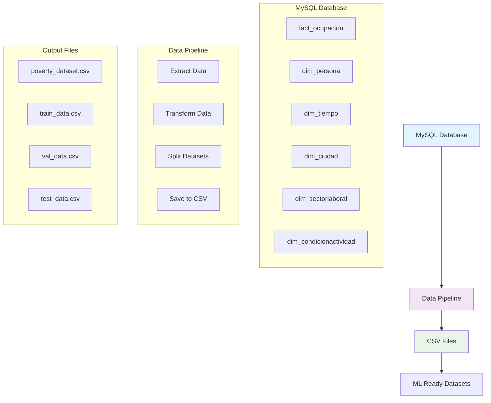
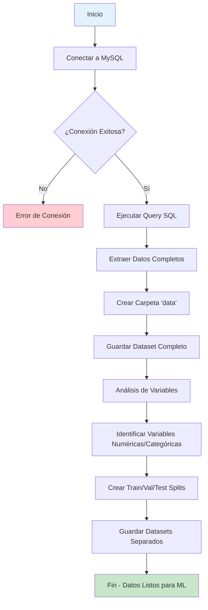
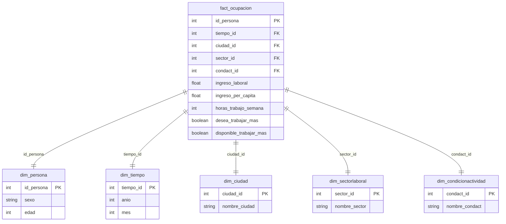

# 📊 Sistema de Análisis de Pobreza - BI Project

## 🎯 Descripción del Proyecto

Este proyecto implementa un sistema completo de Business Intelligence (BI) para el análisis de pobreza, incluyendo:

- **Base de Datos MySQL**: Almacenamiento estructurado de datos demográficos y laborales
- **Pipeline de Datos**: Extracción, transformación y preparación de datos para ML
- **Análisis Predictivo**: Preparación de datasets para modelos de machine learning

## 🏗️ Arquitectura del Sistema



## 🚀 Instalación y Configuración

### Prerrequisitos

- Python 3.8+
- MySQL Server
- Docker (opcional, para base de datos)

### 1. Clonar el Repositorio

```bash
git clone <repository-url>
cd bi/project
```

### 2. Configurar Entorno Virtual

```bash
# Crear entorno virtual
python -m venv venv

# Activar entorno virtual
# En Linux/Mac:
source venv/bin/activate
# En Windows:
venv\Scripts\activate
```

### 3. Instalar Dependencias

```bash
pip install -r requirements.txt
```

### 4. Configurar Base de Datos MySQL

Este paso va a tomar el archivo `bi.sql` y lo va a ejecutar en la base de datos `poverty_analysis` automáticamente usando docker compose.

```bash
# Levantar MySQL con Docker Compose
docker compose up -d

# Verificar que el contenedor esté corriendo
docker ps
```

## 📈 Pipeline de Datos

### Flujo de Procesamiento



### Estructura de Datos



## 🔧 Uso del Pipeline

### Ejecutar Pipeline Completo

```bash
# Activar entorno virtual (si no está activado)
source venv/bin/activate

# Ejecutar pipeline de datos
python data_pipeline.py
```

### Salida Esperada

```
=== PIPELINE DE DATOS PARA ANÁLISIS DE POBREZA ===
Carpeta de datos: data
Extrayendo datos de MySQL...
Dataset extraído: (10000, 14)
Dataset guardado como data/poverty_dataset.csv

=== ANÁLISIS DE VARIABLES PARA PREDICCIÓN DE POBREZA ===
Columnas disponibles: ['id_persona', 'tiempo_id', 'anio', 'mes', 'nombre_ciudad', 'nombre_sector', 'nombre_condact', 'sexo', 'edad', 'ingreso_laboral', 'ingreso_per_capita', 'horas_trabajo_semana', 'desea_trabajar_mas', 'disponible_trabajar_mas']

Variables numéricas (8): ['id_persona', 'tiempo_id', 'anio', 'mes', 'edad', 'ingreso_laboral', 'ingreso_per_capita', 'horas_trabajo_semana']
Variables categóricas (6): ['nombre_ciudad', 'nombre_sector', 'nombre_condact', 'sexo', 'desea_trabajar_mas', 'disponible_trabajar_mas']

=== CREANDO CONJUNTOS DE DATOS ===
Train: 6400 muestras
Validation: 1600 muestras
Test: 2000 muestras

=== ARCHIVOS CREADOS ===
- data/poverty_dataset.csv (dataset completo)
- data/train_data.csv (entrenamiento)
- data/val_data.csv (validación)
- data/test_data.csv (test)

✅ Pipeline completado. Datos listos para Keras!
```

## 📁 Estructura de Archivos Generados

```
project/
├── data/                          # Carpeta con datasets procesados
│   ├── poverty_dataset.csv        # Dataset completo
│   ├── train_data.csv            # Datos de entrenamiento (64%)
│   ├── val_data.csv              # Datos de validación (16%)
│   └── test_data.csv             # Datos de test (20%)
├── data_pipeline.py              # Script principal del pipeline
├── bi.sql                        # Script de base de datos
├── docker-compose.yml            # Configuración Docker
├── requirements.txt              # Dependencias Python
└── README.md                     # Este archivo
```

## 🔍 Funcionalidades del Pipeline

### 1. Extracción de Datos
- **Fuente**: Base de datos MySQL con esquema dimensional
- **Query**: JOIN entre tablas fact y dimensiones
- **Campos**: 14 variables demográficas y laborales

### 2. Análisis Exploratorio
- **Identificación automática** de variables numéricas y categóricas
- **Estadísticas descriptivas** del dataset
- **Detección de indicadores de pobreza** basada en nombres de columnas

### 3. Preparación para ML
- **División automática** en train/validation/test (64%/16%/20%)
- **Manejo de variables objetivo** (target column)
- **Guardado estructurado** en formato CSV

### 4. Variables del Dataset

| Variable                  | Tipo       | Descripción                      |
| ------------------------- | ---------- | -------------------------------- |
| `id_persona`              | Numérico   | Identificador único de persona   |
| `anio`, `mes`             | Numérico   | Dimensiones temporales           |
| `nombre_ciudad`           | Categórico | Ciudad de residencia             |
| `nombre_sector`           | Categórico | Sector laboral                   |
| `nombre_condact`          | Categórico | Condición de actividad           |
| `sexo`                    | Categórico | Género                           |
| `edad`                    | Numérico   | Edad en años                     |
| `ingreso_laboral`         | Numérico   | Ingreso por trabajo              |
| `ingreso_per_capita`      | Numérico   | Ingreso per cápita               |
| `horas_trabajo_semana`    | Numérico   | Horas trabajadas por semana      |
| `desea_trabajar_mas`      | Booleano   | Deseo de trabajar más horas      |
| `disponible_trabajar_mas` | Booleano   | Disponibilidad para trabajar más |

## 🛠️ Comandos Útiles

### Verificar Estado de la Base de Datos
```bash
# Conectar a MySQL
mysql -u analyst -p poverty_analysis

# Verificar tablas
SHOW TABLES;

# Verificar datos
SELECT COUNT(*) FROM fact_ocupacion;
```

### Verificar Archivos Generados
```bash
# Listar archivos en carpeta data
ls -la data/

# Ver tamaño de archivos
du -h data/*.csv

# Ver primeras líneas de un archivo
head -5 data/poverty_dataset.csv
```

### Limpiar Datos Generados
```bash
# Eliminar carpeta data (cuidado: elimina todos los datasets)
rm -rf data/
```

## 🔧 Configuración Avanzada

### Modificar Parámetros del Pipeline

En `data_pipeline.py`, puedes ajustar:

```python
# Tamaños de división de datos
test_size=0.2    # 20% para test
val_size=0.2     # 20% para validación (del 80% restante)

# Variable objetivo personalizada
target_column = 'ingreso_per_capita'  # Cambiar variable objetivo
```

### Variables de Entorno (Opcional)

Crear archivo `.env`:
```env
MYSQL_HOST=localhost
MYSQL_PORT=3306
MYSQL_DATABASE=poverty_analysis
MYSQL_USER=analyst
MYSQL_PASSWORD=analyst123
```

## 🐛 Solución de Problemas

### Error de Conexión a MySQL
```bash
# Verificar que MySQL esté corriendo
sudo systemctl status mysql

# Verificar credenciales
mysql -u analyst -p
```

### Error de Dependencias
```bash
# Reinstalar dependencias
pip install --upgrade -r requirements.txt
```

### Error de Permisos
```bash
# Dar permisos de escritura a la carpeta data
chmod 755 data/
```

## 📊 Próximos Pasos

1. **Análisis Exploratorio**: Crear visualizaciones con los datos generados
2. **Modelos de ML**: Implementar modelos predictivos con Keras/TensorFlow
3. **Dashboard**: Crear interfaz web para visualización
4. **Automatización**: Programar ejecución automática del pipeline

# Poverty Prediction ML Pipeline

Este proyecto implementa un pipeline completo de machine learning para la predicción de pobreza, con opciones flexibles para entrenar diferentes tipos de modelos.

## Características

- **Análisis de datos completo** con visualizaciones
- **Ingeniería de características** automática
- **Múltiples tipos de modelos**:
  - Modelos lineales (Regresión Lineal, Logística)
  - Redes neuronales (Clasificación y Regresión)
- **Comparación automática** de modelos
- **Generación de reportes** y visualizaciones
- **Interfaz de línea de comandos** para selección de modelos

## Instalación

1. Clonar el repositorio
2. Crear un entorno virtual:
```bash
python -m venv venv
source venv/bin/activate  # En Linux/Mac
# o
venv\Scripts\activate  # En Windows
```

3. Instalar dependencias:
```bash
pip install -r requirements.txt
```

## Uso

### Interfaz de Línea de Comandos

El pipeline se ejecuta a través del archivo `main.py` con opciones para seleccionar qué modelos entrenar:

#### Opciones disponibles:

- `--models linear`: Entrenar solo modelos lineales
- `--models neural`: Entrenar solo redes neuronales  
- `--models both`: Entrenar ambos tipos de modelos (por defecto)

#### Ejemplos de uso:

```bash
# Entrenar solo modelos lineales
python ml_pipeline/main.py --models linear

# Entrenar solo redes neuronales
python ml_pipeline/main.py --models neural

# Entrenar ambos tipos de modelos
python ml_pipeline/main.py --models both

# Con opciones adicionales
python ml_pipeline/main.py --models linear --data_path data/mi_dataset.csv --output_dir resultados
```

#### Argumentos completos:

```bash
python ml_pipeline/main.py --help
```

Argumentos disponibles:
- `--data_path`: Ruta al archivo CSV del dataset (por defecto: `../data/poverty_dataset.csv`)
- `--output_dir`: Directorio para guardar resultados (por defecto: `ml_results`)
- `--target_method`: Método para crear la variable objetivo (por defecto: `income_threshold`)
- `--models`: Tipos de modelos a entrenar (`linear`, `neural`, `both`)

### Flujo del Pipeline

1. **Análisis de Datos**: Exploración completa del dataset
2. **Ingeniería de Características**: Preparación y transformación de datos
3. **Entrenamiento de Modelos**: Según la selección del usuario
4. **Comparación de Modelos**: Evaluación automática del rendimiento
5. **Generación de Reportes**: Guardado de modelos, gráficos y métricas

### Salidas

El pipeline genera:
- **Modelos entrenados** en formato `.pkl` (lineales) y `.h5` (redes neuronales)
- **Gráficos de comparación** de rendimiento
- **Reportes de análisis** de datos
- **Resumen de resultados** en formato JSON
- **Visualizaciones** de importancia de características y historial de entrenamiento

## Estructura del Proyecto

```
project/
├── ml_pipeline/
│   ├── main.py              # Punto de entrada con CLI
│   ├── model_trainer.py     # Orquestador principal
│   ├── data_analyzer.py     # Análisis de datos
│   ├── feature_engineer.py  # Ingeniería de características
│   ├── linear_models.py     # Modelos lineales
│   └── neural_network.py    # Redes neuronales
├── data/
│   └── poverty_dataset.csv  # Dataset de ejemplo
└── ml_results/              # Resultados generados
```

## Notas

- Los modelos se comparan automáticamente usando métricas apropiadas (R² para regresión, accuracy para clasificación)
- Solo se generan reportes y comparaciones si se entrenan modelos
- El pipeline es robusto y maneja errores gracefully
